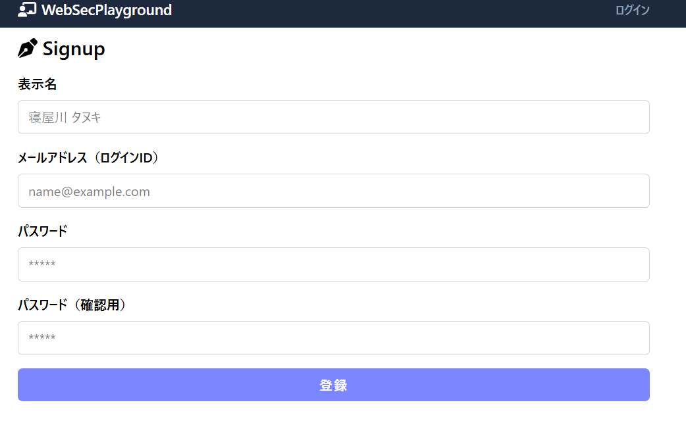
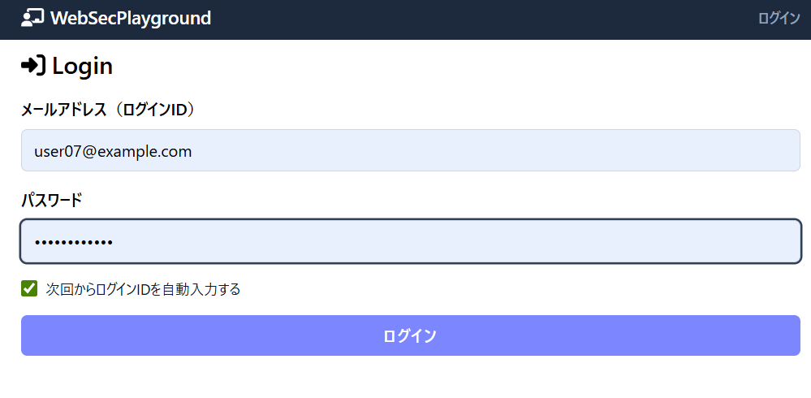
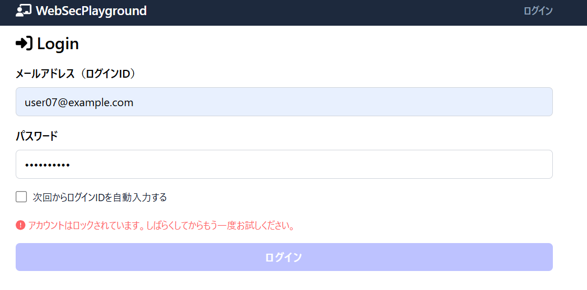

実装にかかった時間 12時間

ログイン画面の例です。

サインアップ画面の例です。

パスワード変更画面の例です。

主な機能は以下のものになります

セッションベース認証・認可:
ユーザーログイン (/login) とログアウト (/logout) 機能。
セッション管理とクッキーを使用した認証状態の維持。

アカウントロックアウト機能 (N回のログイン失敗時):
連続してログインに失敗すると、アカウントが一時的にロックされる機能が実装されています。

ユーザーサインアップ (/signup):
Server Actions (Custom Invocation) を利用したユーザー登録。
パスワードと確認用パスワードの入力と一致検証。

Zodを使用したデータ検証:
入力データのスキーマ定義と検証。

SWRによるデータフェッチ:
クライアントサイドのデータフェッチにSWRを活用。

意図的な脆弱性
このプロジェクトには、セキュリティ学習のために以下の脆弱性が意図的に含まれています。

クロスサイトスクリプティング (XSS):

ニュースページ (/news) では、URLクエリパラメータ name の値を無害化（サニタイズ）せずに dangerouslySetInnerHTML を使用してHTMLとして出力しています。これにより、悪意のあるスクリプトが実行される可能性があります。

api/xss エンドポイントは、XSS攻撃によって盗まれたコンテンツを受け取るために設計されています。

クロスサイトリクエストフォージェリ (CSRF):

クッキーの設定において、sameSite 属性が適切に設定されていない場合、CSRF脆弱性につながる可能性があります。

安全でないパスワードの保存と検証:

サインアップ処理 (src/app/_actions/signup.ts) では、パスワードがハッシュ化されずに保存されています。

ログイン処理 (src/app/api/login/route.ts) では、パスワードの検証が不適切です。

情報漏洩:

ログイン失敗時 (src/app/api/login/route.ts) およびサインアップ時 (src/app/_actions/signup.ts) に、ユーザー名（メールアドレス）の有効・無効に関する情報が推測できるメッセージが返されます。

サーバーサイドで発生したエラーメッセージがクライアントにそのまま公開される可能性があります。

不適切なクッキーセキュリティ:

セッションクッキー名が典型的であり、XSS攻撃の標的になりやすいです。

secure: false が設定されており、HTTPS環境下でクッキーが安全でない通信で送信される可能性があります。

セットアップ手順
1. リポジトリのクローン
Bash

git clone https://github.com/TakeshiWada1980/web-sec-playground-1.git
cd web-sec-playground-1
上記でクローンすると、カレントフォルダのなかに web-sec-playground-1 というフォルダが新規作成されて展開されます。別名にしたいときは、たとえば hoge というフォルダにクローンしたいときは、次のようにしてください。

git clone https://github.com/TakeshiWada1980/web-sec-playground-1.git hoge
cd hoge
2. 依存関係のインストール

npm i
3. 環境変数の設定ファイル (.env) の作成
プロジェクトのルートフォルダに .env (環境変数の設定ファイル) を新規作成して以下の内容を記述してください。

DATABASE_URL="file:./app.db"
4. データベースの初期化
prisma/schema.prisma にログインロックアウト用のフィールド (failedLoginAttempts と lockoutUntil) を追加した後、以下のコマンドを実行してデータベースを初期化してください。

npx prisma db push
npx prisma generate
npx prisma db seed

5. 開発サーバの起動
npm run dev

6. ビルドと実行

npm run build
npm run start
データベースの状態確認
npx prisma studio
